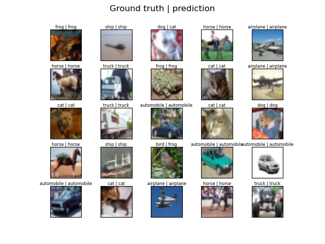

# Image classification on CIFAR-10 dataset

Home-made image classification training and inference script.

**Training**
```bash
python CIFAR-10_main.py
```
Will resume training if trained model file `trained_model.pt` and loss/acc list binary `output` exist.

**Inference**
Need to have `trained_model.pt` on root folder.
```bash
python inference.py
```

 \
*Output prediction plot*


**Requirement**
- Python 3.6+
- PyTorch 1.0+
- Numpy
- tqdm

---

Dataset source: http://www.cs.toronto.edu/~kriz/cifar.html

Pytorch network model ('resnet.py') from Kuang Liu (https://github.com/kuangliu/pytorch-cifar).

Loader script ('load_cifar_10_alt.py') based on Petras Saduikis (https://github.com/snatch59/load-cifar-10).

Training script ('CIFAR-10_main.py') adapted from MITx6.86x-Machine Learning with Python-From Linear Models to Deep Learning (https://www.edx.org/course/machine-learning-with-python-from-linear-models-to).
